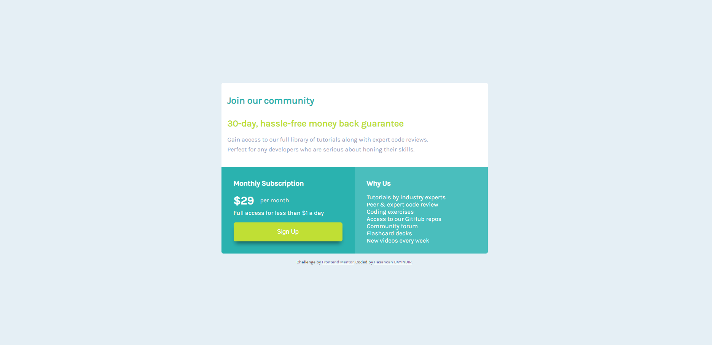

# Frontend Mentor - Single price grid component



## Welcome! 👋

Thanks for checking out this front-end coding challenge.

## Table of contents

  - [Links](#links)
  - [My process](#my-process)
  - [Built with](#built-with)
  - [What I learned](#what-i-learned)
  - [Useful resources](#useful-resources)
  - [Author](#author)

## My process

### Built with

- Semantic HTML5 markup
- CSS custom properties
- Flexbox
- Mobile-first workflow


### What I learned

I have learned how to mobile-first design.

```css
@media only screen and (min-width: 425px) and (max-width: 768px) {

    body {
        display: flex;
        flex-direction: row;
        justify-content: center;
        align-items: center;
        min-height: 100vh;
    }


    .card {
        max-width: 700px;
    }

    .pi {
        display: flex;
        flex-direction: row;
        justify-content: center;
    }

    .pi .price {
        max-width: 100%;
        border-radius: 0 0 0 0.325rem;
    }

    .pi .info {
        border-radius: 0 0 0.325rem 0;
    }

}
.
.
.
```

### Useful resources

- [Box Shadow Generator](https://www.cssmatic.com/box-shadow) - This helped me for set easily box shadow.

## Author

- Frontend Mentor - [bayindirhsncn](https://www.frontendmentor.io/profile/bayindirhsncn)
- LinkedIn - [hasancan-bayindir](https://www.linkedin.com/in/hasancan-bayindir/)